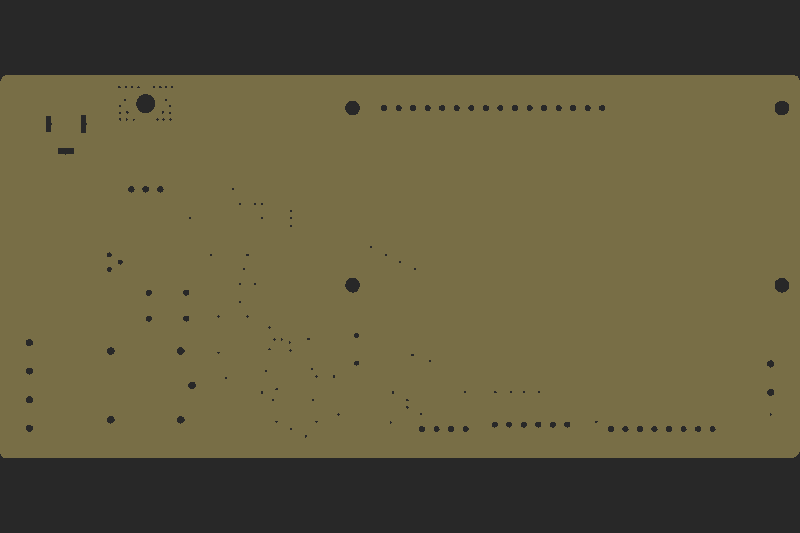

# 2 Factor Authenticated Door Lock

## Introduction

The 2 Factor door lock is a locking system built using Arduino UNO, LCD display, R307 fingerprint sensor and keypad.

## Folder Structure

1. docs/top-layer.png : PCB Board top Design
2. docs/bottom-layer.png : PCB Board bottom design
3. docs/drills.png : PCB Board drills design
4. eagle-design : PCB design
5. src : code

## PCB Design

### Top Layer

### Bottom Layer

### Drills Design

